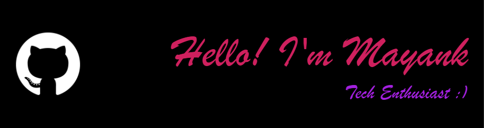

</a>

# Hi, I'm Mayank

I am a developer focused on building applications using Generative AI.

## What I’m working on

* Building GenAI applications using LLMs
* Exploring prompt engineering and few-shot learning
* Working with tools like LangChain and APIs

## Projects

* GenAI LinkedIn Post Generator
* LLM-based applications (in progress)

## Tech Stack

Python, Streamlit, LangChain, APIs

## Goal

To become a skilled GenAI developer and work on real-world AI applications.

